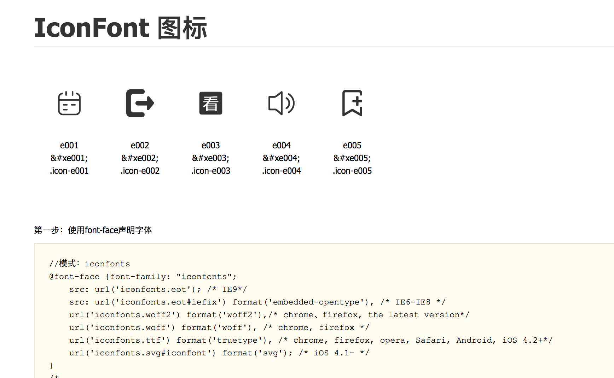
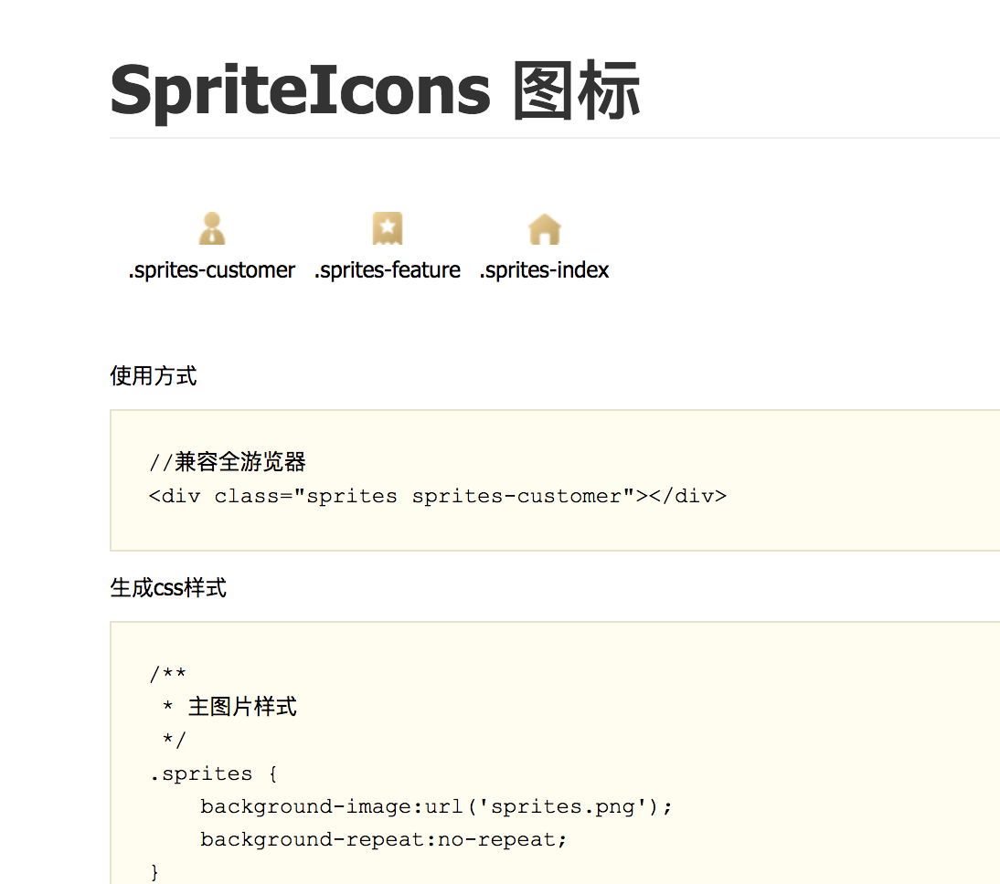

# use-icons
Provide svg  to iconfont and png/jpg to sprity-image


## Installation

`npm install use-icons`

## Use

```
var useIcons = require("use-icons");

/**
 * Generate the sprites - image
 */
var pics = []; 
var picOptions = {};
useIcons.pic2icons(pics, picOptions, function(err, files) {
});

/**
 * Generate svg icon fonts
 */
var svgs = [];
var svgOptions = {};
useIcons.svg2icons(svg, svgOptions, function(err, files) {
});
```

## Documentation

### API

* svg2icons(data, options, callback)
    * data Array
    
        ```
        [
            {
                file: "./aa.svg", //The SVG file path
                unicode : "e001", //font unicode
                classname : "aa", //default unicode, output classname
            },
            {
                content: "<svg>...</svg>", // The content of the SVG file
                unicode : "e002", //font unicode
                classname : "bb", //default unicode, output classname
            },
            ...
        ]
        ```
    * options:Object
        
        [svgicons2svgfont options](https://github.com/nfroidure/svgicons2svgfont#new-svgicons2svgfontstreamoptions)
    
        ```
        {
            fileName : "", //Type: String default: iconfonts, font file name
            classPrefix : "",//Type: String default: "icon-", font class prefix
            fontBaseUri : "", //Type: String default: "", font url
            fontOptions : [], //Type: Array default : [{family : "iconfonts", classname : "iconfonts"}]
            resetViewBoxSize : false, //Type: Boolean Default: false, 
            prependUnicode : false, //Type: Boolean Default: false, The automation of module
            startUnicode : 0xE001, //Type: Number, Default - 0xE001, the number of the start unicode
            /*--- svgicons2svgfont options ---*/
            fontName : "", //required, Type: String Default value: 'iconfont',The font family name you want.
            fontId : "", //Type: String Default value: the options.fontName value,The font id you want.
            fontStyle : "", //Type: String Default value: '',The font style you want.
            fontWeight : "", //Type: String Default value: '',The font weight you want.
            fixedWidth : false, // Type: Boolean Default value: false,Creates a monospace font of the width of the largest input icon
            centerHorizontally : false, //Type: Boolean Default value: false,Calculate the bounds of a glyph and center it horizontally.
            normalize : false, //Type: Boolean Default value: false,Normalize icons by scaling them to the height of the highest icon.
            fontHeight : "", //Type: Number Default value: MAX(icons.height) The outputted font height (defaults to the height of the highest input icon).
            round : 10e12,//Type: Number Default value: 10e12 Setup SVG path rounding.
            descent : 0, //Type: Number Default value: 0,The font descent. It is usefull to fix the font baseline yourself.
            ascent : "", //Type: Number Default value: fontHeight - descent,The font ascent. Use this options only if you know what you're doing. A suitable value for this is computed for you.
            metadata : "", //Type: String Default value: undefined,The font metadata(https://www.w3.org/TR/SVG/metadata.html). You can set any character data in but it is the be suited place for a copyright mention.
            log : "",//Type: Function Default value: console.log,Allows you to provide your own logging function. Set to function(){} to impeach logging.
        }
        ```
    * callback(err, files):Function
        * err Mixed // error info
        * files Array//out files content
        
            ```
            [
                {
                    fileName : options.fileName,// same of Options.fileName
                    fileType : "svg",
                    content : "..."
                },
                {
                    fileName : options.fileName,// same of Options.fileName
                    fileType : "eof",
                    content : "..."
                },
                {
                    fileName : options.fileName,// same of Options.fileName
                    fileType : "ttf",
                    content : "..."
                },
                {
                    fileName : options.fileName,// same of Options.fileName
                    fileType : "woff",
                    content : "..."
                },
                {
                    fileName : options.fileName,// same of Options.fileName
                    fileType : "woff2",
                    content : "..."
                },
                {
                    fileName : options.fileName,// same of Options.fileName
                    fileType : "css",
                    content : "..."
                },
                {
                    fileName : options.fileName,// same of Options.fileName
                    fileType : "html",
                    content : "..."
                }
            ]
            ```
  
 __Demo__
 


* pic2icons(data, options, callback)
    * data:Array
    
        ```
        [
            {
                file: "./aa.jpg", //The Image file path
                classname : "aa", //Default: filename, output classname
            },
            {
                file: "./bb.jpg", //The Image file path
                classname : "bb", //Default: filename, output classname
            },
            ...
        ]
        ```
    * options:Object
    
        [Spritesmith Options](https://github.com/Ensighten/spritesmith#algorithms)
    
        ```
        {
            padding : 5, //Default: 5, The Image space
            /*--- Spritesmith Options ---*/
            algorithm : "binary-tree",//Default: binary-tree,top-down，left-right，diagonal，alt-diagonal,binary-tree
            quality : 100, //Default: 100, The quality of the picture
            sort : false,//Default: false, Whether the sorting
            imageName : "sprites.png", //Default: sprites.png, output Sprites Image
            imageUrl : "",//Default: options.imageName, background-image:url image-url
            classMain : "sprites, //Default: sprites, main class
            classPrefix : "sprites-" //Default: "sprites-", class prefix
        }
        ```
    * callback(err, files):Function
        * err Mixed // error info
        * files Array//out files content
        
            ```
            [
                {
                    fileName : options.imageName.replace(/\.([^\.]+)$/, ""),
                    fileType : options.imageName.replace(/.*\.([^\.]+)$/, "$1"),
                    content : "..."
                },
                {
                    fileName : "sprites",
                    fileType : "css",
                    content : "..."
                },
                {
                    fileName : "sprites",
                    fileType : "html",
                    content : "..."
                }
            ]
            ```
    
 __Demo__
 


* hex2int(intStr)
    * intStr Number
* int2hex(hexStr)
    * hexStr String
    
## License

[MIT](./LICENSE)